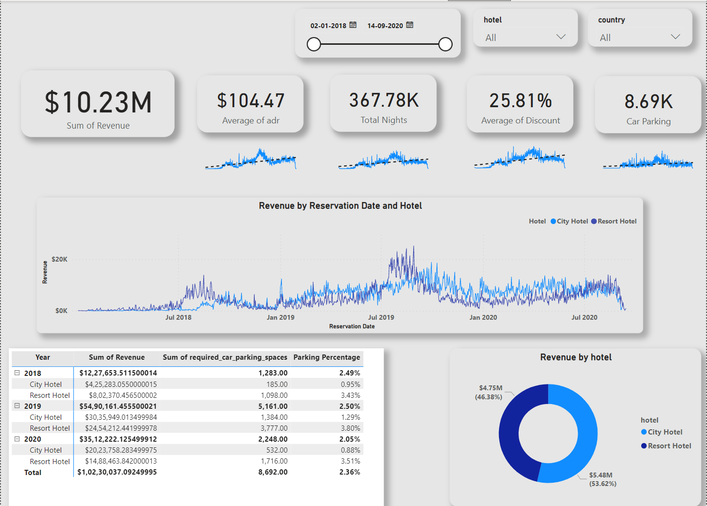

# [Project 1: Hotel Booking Data and Revenue Analysis](https://github.com/asifsk32/Hotel-Revenue.git)

It is an Exploratary Data Analysis project on the Hotel Booking Data. Where to develop a Database and visualize the Hotel Booking Data

Expected outcomes of the project are: 
  1. Revenue Analysis year on year
  2. Should we increase our parking lot size
  3. Average Daily rate of the hotel
  
  
- Data was taken from the public domain
- Technologies used: Mircosoft SQL Server Management Studio and Power BI Desktop
- SQL is used to Analyse the Data and join the different tables
- Power BI to Visualize the trends of Revenue year on year, Adr, Total bookings across the countries

## Hotel Booking Data Dashboard 
